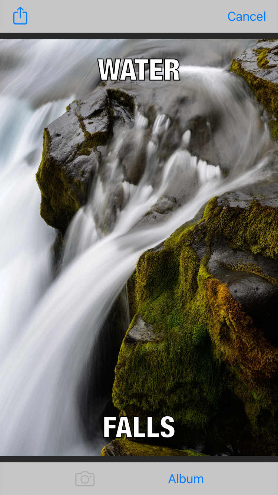
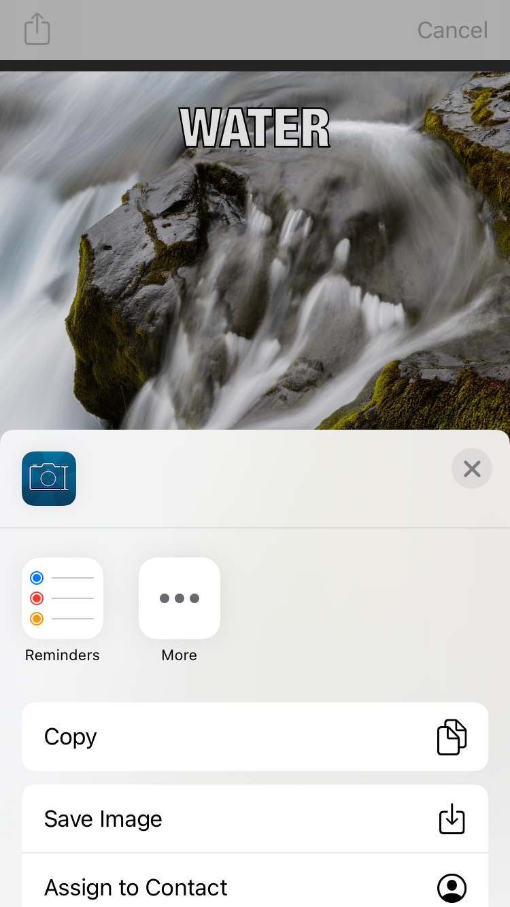

# MemeMe

MemeMe is an iPhone app that allows users to create and share memes. It is the second project of Udacity's [iOS Developer Nanodegree Program](https://www.udacity.com/course/ios-developer-nanodegree--nd003). 

## Screenshots
| Getting started | Composing a meme | Sharing a meme |
| --------------- | ---------------- | -------------- |
|  |  |  |